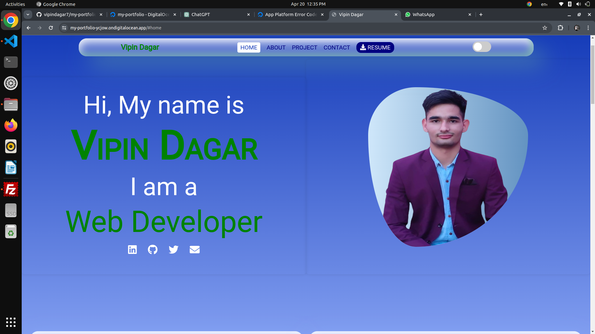
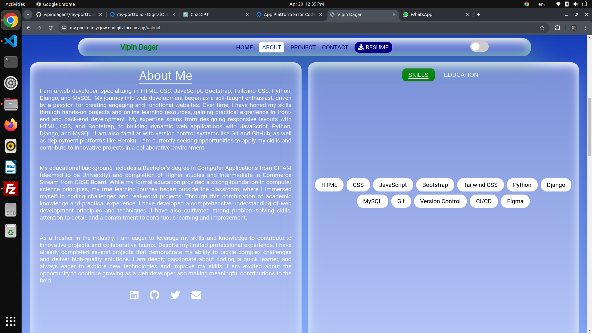
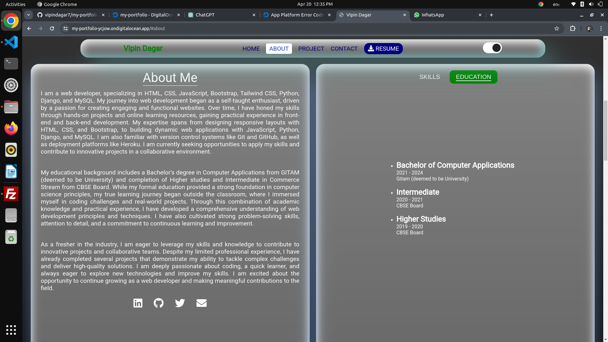
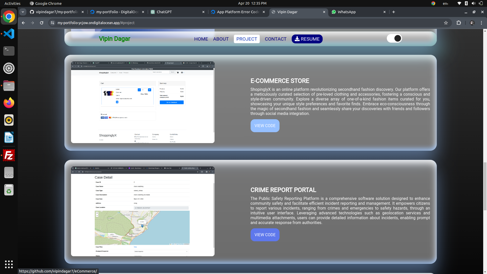
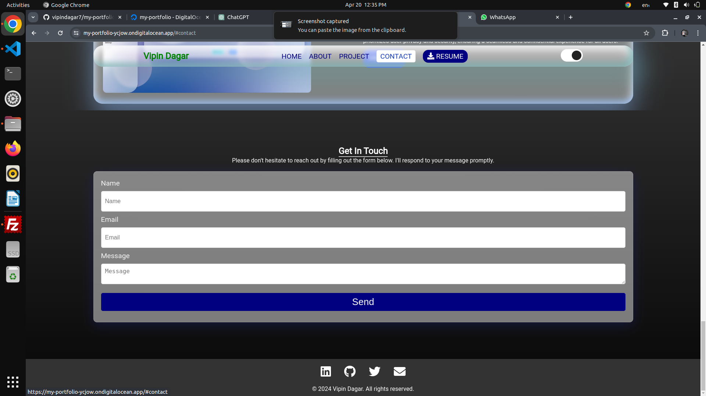

# Django Portfolio 🚀

## Overview
This Django Portfolio is a web application designed to showcase your projects, skills, and experiences in an organized and visually appealing manner. It allows you to create and manage portfolio items, categorize them, and provide detailed information about each project or skill.

## Features

- **Categorization**: 🗂 Organize your portfolio items into different categories for better navigation and presentation.
- **Rich Text Editing**: ✍️ Utilize rich text editing to provide detailed descriptions and information about each portfolio item.
- **Responsive Design**: 📱 The portfolio is designed to be fully responsive, ensuring optimal viewing experience across devices of all sizes.
- **Contact Form**: 📧 Integrated contact form allows visitors to get in touch with you directly through the website.

## Sample Screenshots





## Installation
1. Clone the repository to your local machine:

    ```
    git clone https://github.com/vipindagar7/my-portfolio.git
    ```

2. Navigate to the project directory:

    ```
    cd django-portfolio
    ```

3. Install dependencies using pip:

    ```
    pip install -r requirements.txt
    ```

4. Apply database migrations:

    ```
    python manage.py migrate
    ```

5. Create a superuser account:

    ```
    python manage.py createsuperuser
    ```

6. Start the development server:

    ```
    python manage.py runserver
    ```

7. Visit `http://localhost:8000` in your web browser to access the application.

## Configuration
- **Settings**: Customize the project settings in `settings.py` to suit your requirements, such as database configuration, static files, and security settings.
- **Environment Variables**: Consider using environment variables for sensitive settings such as secret keys and database credentials.
- **Production Deployment**: For production deployment, ensure to configure a production-ready web server (e.g., Nginx or Apache) and deploy the application using WSGI (e.g., Gunicorn).

## Contributing
Contributions are welcome! If you have any suggestions, feature requests, or bug reports, please feel free to open an issue or submit a pull request.

## License
This project is licensed under the [MIT License](LICENSE).

## Acknowledgments
Special thanks to the Django community for their amazing contributions and support.
